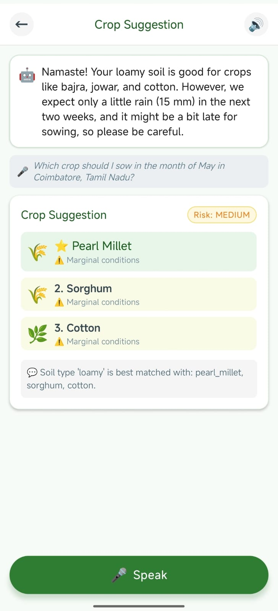
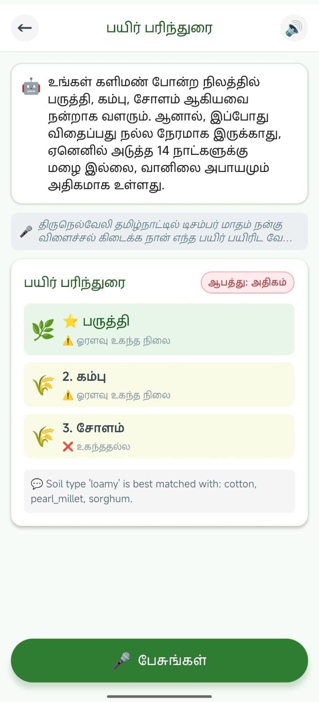
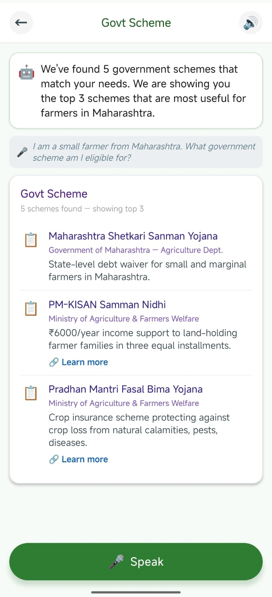
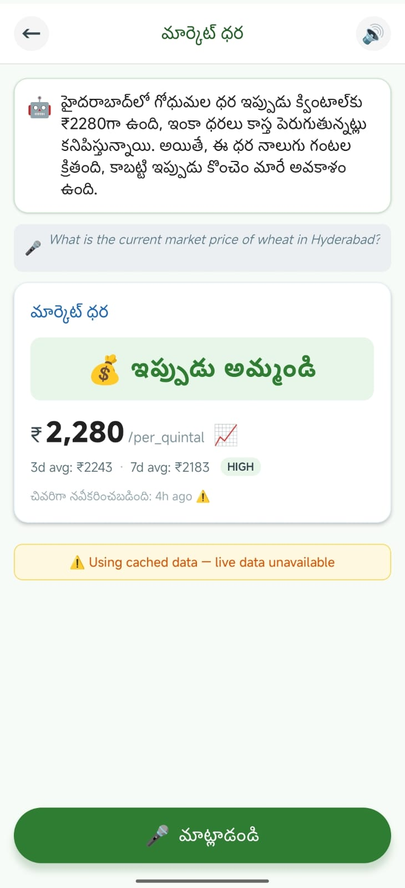

# KisanMitra - The AI Agricultural Assistant for Bharat

KisanMitra is a voice-first, AI-powered agricultural assistant designed specifically for Indian farmers. By bridging the digital literacy gap, it allows farmers to speak natively in their local languages (Hindi, Tamil, Telugu, Kannada, Marathi, Punjabi) and receive highly-accurate, hallucination-free advice regarding crop recommendations, volatile market prices, and government scheme eligibility.

## Key Features

- **Voice-First Interaction**: Integrated with [Sarvam AI&#39;s](https://www.sarvam.ai) `saaras:v3` Speech-to-Text inference to seamlessly transcribe rural Indic languages.
- **Zero-Hallucination AI Architecture**: Uses **Google Gemini** for intent extraction and human-friendly explanation generation, paired with strict, deterministic Python rule-engines that guarantee 100% accurate agricultural advice.
- **Smart Crop Recommendations**: Evaluates crops dynamically based on soil types, fetching live 14-day weather forecasts via Open-Meteo, and comparing against custom agricultural tolerance matrices.
- **Market Price Predictions**: Fetches live Agmarknet data and performs trend analysis and moving averages to advise farmers to 'SELL', 'WAIT', or 'HOLD', maximizing their profit margins.
- **Scheme Matching**: Matches farmers to state and national agricultural schemes based on land holding size, crops grown, and geography.
- **Accessible Mobile App**: A React Native (Expo) mobile frontend optimized for lower-end Android devices with tactile audio feedback, localized UI, and a clean interface.

---

## App Screenshots

<div align="center">
  
  
  
</div>
<br/>
<div align="center">
  
  
  
</div>

---

## Demo

<div align="center">
  <video src="./frontend/assets/images/working.mp4" controls width="auto" style="border-radius: 5px;"></video>
</div>

---

## Tech Stack

- **Frontend**: React Native, Expo
- **Backend**: FastAPI, Python
- **Databases**: PostgreSQL (Main DB), Redis (API rate limit & high-speed caching)
- **AI/LLM**: Google Gemini (`google-generativeai`)
- **Speech-to-Text**: Sarvam AI (`saaras:v3`)
- **Weather Data**: [Open-Meteo](https://open-meteo.com/) — Free, open-source weather API (no key required)
- **Market Price Data**: [Agmarknet](https://agmarknet.gov.in/) — Government of India's agricultural commodity price portal

---

## How to Run Locally

### 1. Pre-requisites

- **Node.js**: v18+
- **Python**: v3.11+
- **Docker & Docker Compose**: Required for running the PostgreSQL database and Redis caching servers.

### 2. Backend Setup

1. Navigate into the backend repository.
   ```bash
   cd backend
   ```
2. Set up your Python environment and activate it.
   ```bash
   python3 -m venv venv
   source venv/bin/activate
   ```
3. Install backend dependencies.
   ```bash
   pip install -r requirements.txt
   ```
4. Set up the Environment Variables by copying the `.env.example`.
   ```bash
   cp .env.example .env
   # Ensure you set your GEMINI_API_KEY inside the .env file!
   ```
5. **Start Docker Services** (CRITICAL). This starts the Redis and Postgres containers in the background.
   ```bash
   docker-compose up -d
   ```
6. Run the FastAPI Application.
   ```bash
   uvicorn app.main:app --host 0.0.0.0 --port 8000 --reload
   ```

### 3. Frontend Setup

1. Open a new terminal and navigate to the frontend directory.
   ```bash
   cd frontend
   ```
2. Install npm dependencies.
   ```bash
   npm install
   ```
3. Set your environment variables by copying the example.
   ```bash
   cp .env.example .env
   ```

   **Important configs in `.env`:**- Add your [Sarvam AI Key](https://developer.sarvam.ai) to `EXPO_PUBLIC_SARVAM_API_KEY`.
   - Update `EXPO_PUBLIC_API_BASE_URL` depending on where you are testing. (Web uses `127.0.0.1`, but physical Android devices over Wi-Fi will need your developer machine's local IPv4 address like `192.168.1.5` or `10.99.12.124`).
4. Start the Expo application.
   ```bash
   npx expo start
   ```
5. Scan the QR Code using the **Expo Go** app on your Android/iOS physical device, or press `w` to open it in your local browser for rapid testing!

---

## License

This project is licensed under the **MIT License**. See the [LICENSE](./LICENSE) file for details.

---